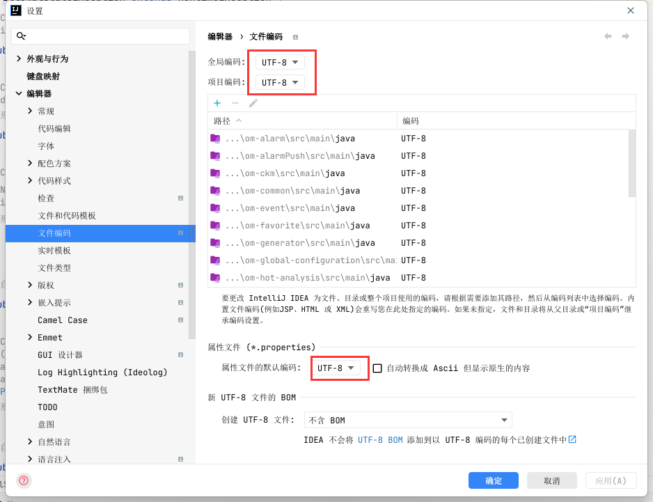

# ymal 文件编译后乱码导致的问题

### 原因

在ymal文件中，使用UTF-8编码，而在idea设置中ymal、properties文件使用的非UTF-8编码，所以在编译后，发现乱码。

### 异常信息


```java
java.lang.IllegalStateException: Failed to load property source from 'file:/D:/Workspace/yqfk-jc-admin/om-system/target/classes/config/application.yml' (classpath:/config/application.yml)
 at org.springframework.boot.context.config.ConfigFileApplicationListener$Loader.load(ConfigFileApplicationListener.java:564)
 at org.springframework.boot.context.config.ConfigFileApplicationListener$Loader.loadForFileExtension(ConfigFileApplicationListener.java:501)
 at org.springframework.boot.context.config.ConfigFileApplicationListener$Loader.load(ConfigFileApplicationListener.java:471)
 at org.springframework.boot.context.config.ConfigFileApplicationListener$Loader.lambda$null$7(ConfigFileApplicationListener.java:450)
 at java.base/java.lang.Iterable.forEach(Iterable.java:75)
 at org.springframework.boot.context.config.ConfigFileApplicationListener$Loader.lambda$load$8(ConfigFileApplicationListener.java:450)
 at java.base/java.lang.Iterable.forEach(Iterable.java:75)
 at org.springframework.boot.context.config.ConfigFileApplicationListener$Loader.load(ConfigFileApplicationListener.java:447)
 at org.springframework.boot.context.config.ConfigFileApplicationListener$Loader.lambda$load$0(ConfigFileApplicationListener.java:350)
 at org.springframework.boot.context.config.FilteredPropertySource.apply(FilteredPropertySource.java:54)
 at org.springframework.boot.context.config.ConfigFileApplicationListener$Loader.load(ConfigFileApplicationListener.java:338)
 at org.springframework.boot.context.config.ConfigFileApplicationListener.addPropertySources(ConfigFileApplicationListener.java:229)
 at org.springframework.boot.context.config.ConfigFileApplicationListener.postProcessEnvironment(ConfigFileApplicationListener.java:213)
 at org.springframework.boot.context.config.ConfigFileApplicationListener.onApplicationEnvironmentPreparedEvent(ConfigFileApplicationListener. java:203)
 at org.springframework.boot.context.config.ConfigFileApplicationListener.onApplicationEvent(ConfigFileApplicationListener.java:191)
 at org.springframework.context.event.SimpleApplicationEventMulticaster.doInvokeListener(SimpleApplicationEventMulticaster.java:172)
 at org.springframework.context.event.SimpleApplicationEventMulticaster.invokeListener(SimpleApplicationEventMulticaster.java:165)
 at org.springframework.context.event.SimpleApplicationEventMulticaster.multicastEvent(SimpleApplicationEventMulticaster.java:139)
 at org.springframework.context.event.SimpleApplicationEventMulticaster.multicastEvent(SimpleApplicationEventMulticaster.java:127)
 at org.springframework.boot.context.event.EventPublishingRunListener.environmentPrepared(EventPublishingRunListener.java:80)
 at org.springframework.boot.SpringApplicationRunListeners.environmentPrepared(SpringApplicationRunListeners.java:53)
 at org.springframework.boot.SpringApplication.prepareEnvironment(SpringApplication.java:342)
 at org.springframework.boot.SpringApplication.run(SpringApplication.java:307)
 at org.springframework.boot.SpringApplication.run(SpringApplication.java:1247)
 at org.springframework.boot.SpringApplication.run(SpringApplication.java:1236)
 at com.om.AppRun.main(AppRun.java:48)
Caused by: org.yaml.snakeyaml.error.YAMLException: java.nio.charset.MalformedInputException: Input length = 1
 at org.yaml.snakeyaml.reader.StreamReader.update(StreamReader.java:218)
 at org.yaml.snakeyaml.reader.StreamReader.ensureEnoughData(StreamReader.java:176)
 at org.yaml.snakeyaml.reader.StreamReader.ensureEnoughData(StreamReader.java:171)
 at org.yaml.snakeyaml.reader.StreamReader.peek(StreamReader.java:126)
 at org.yaml.snakeyaml.scanner.ScannerImpl.scanToNextToken(ScannerImpl.java:1177)
 at org.yaml.snakeyaml.scanner.ScannerImpl.fetchMoreTokens(ScannerImpl.java:287)
 at org.yaml.snakeyaml.scanner.ScannerImpl.checkToken(ScannerImpl.java:227)
 at org.yaml.snakeyaml.parser.ParserImpl$ParseImplicitDocumentStart.produce(ParserImpl.java:195)
 at org.yaml.snakeyaml.parser.ParserImpl.peekEvent(ParserImpl.java:158)
 at org.yaml.snakeyaml.parser.ParserImpl.checkEvent(ParserImpl.java:148)
 at org.yaml.snakeyaml.composer.Composer.checkNode(Composer.java:82)
 at org.yaml.snakeyaml.constructor.BaseConstructor.checkData(BaseConstructor.java:123)
 at org.yaml.snakeyaml.Yaml$1.hasNext(Yaml.java:489)
 at org.springframework.beans.factory.config.YamlProcessor.process(YamlProcessor.java:200)
 at org.springframework.beans.factory.config.YamlProcessor.process(YamlProcessor.java:164)
 at org.springframework.boot.env.OriginTrackedYamlLoader.load(OriginTrackedYamlLoader.java:82)
 at org.springframework.boot.env.YamlPropertySourceLoader.load(YamlPropertySourceLoader.java:50)
 at org.springframework.boot.context.config.ConfigFileApplicationListener$Loader.loadDocuments(ConfigFileApplicationListener.java:632)
 at org.springframework.boot.context.config.ConfigFileApplicationListener$Loader.load(ConfigFileApplicationListener.java:534)
 ... 25 common frames omitted
Caused by: java.nio.charset.MalformedInputException: Input length = 1
 at java.base/java.nio.charset.CoderResult.throwException(CoderResult.java:274)
 at java.base/sun.nio.cs.StreamDecoder.implRead(StreamDecoder.java:339)
 at java.base/sun.nio.cs.StreamDecoder.read(StreamDecoder.java:178)
 at java.base/java.io.InputStreamReader.read(InputStreamReader.java:181)
 at org.yaml.snakeyaml.reader.UnicodeReader.read(UnicodeReader.java:125)
 at org.yaml.snakeyaml.reader.StreamReader.update(StreamReader.java:183)
 ... 43 common frames omitted

```

### 解决方法

将文件编码设置为UTF-8


