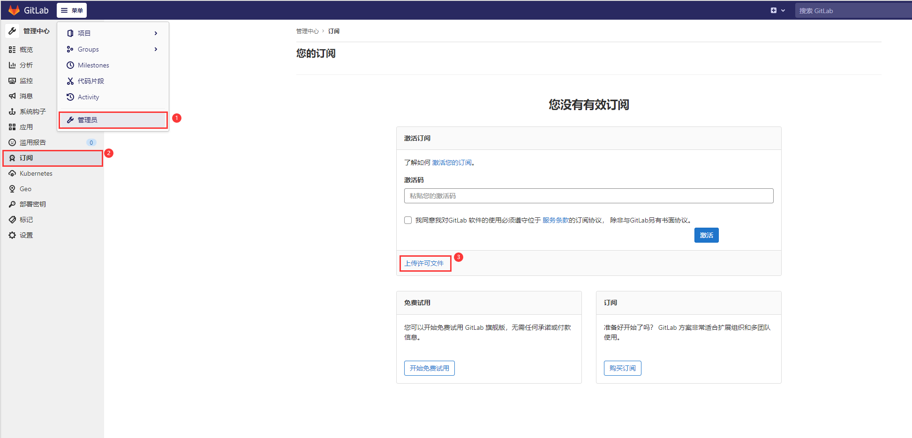

# Docker 安装、破解 GitLab

## 下载 GitLab 镜像

```docker
docker pull gitlab/gitlab-ee:latest
```

## 创建 GitLab 存储卷

```docker
docker volume create --name gitlab
docker volume create --name gitlab-data
docker volume create --name gitlab-logs
```

## 创建 GitLab 容器

```docker
docker run --detach \
  --hostname gitlab.example.com \
  --publish 443:443 --publish 80:80 --publish 22:22 \
  --name gitlab \
  --restart always \
  --volume gitlab:/etc/gitlab \
  --volume gitlab-logs:/var/log/gitlab \
  --volume gitlab-data:/var/opt/gitlab \
  --shm-size 256m \
  gitlab/gitlab-ee:latest
```

## 查看 GitLab 日志

```docker
docker logs -f gitlab
```

## 查看 GitLab root 用户密码

```docker
docker exec -it gitlab grep 'Password:' /etc/gitlab/initial_root_password
```

## 修改 GitLab context-path

进入容器，修改配置文件：/etc/gitlab/gitlab.rb，注意：下面的域名必须和创建容器时候的 --hostname 参数一致，否则会报错。

```rb
external_url "http://gitlab.example.com /gitlab"
```

## 容器内重启 GitLab

```shell
gitlab-ctl reconfigure
gitlab-ctl restart
```

## 破解 GitLab-ee

1.进入容器，执行：

```shell
yum install -y ruby
# 安装gitlab-license库
gem install gitlab-license
```

2.生成许可证：

>参考：<https://www.rubydoc.info/gems/gitlab-license/>

#### 创建 license.rb

```rb
require "openssl"
require "gitlab/license"

key_pair = OpenSSL::PKey::RSA.generate(2048)
File.open("license_key", "w") { |f| f.write(key_pair.to_pem) }

public_key = key_pair.public_key
File.open("license_key.pub", "w") { |f| f.write(public_key.to_pem) }

private_key = OpenSSL::PKey::RSA.new File.read("license_key")
Gitlab::License.encryption_key = private_key

license = Gitlab::License.new
license.licensee = {
  "Name" => "none",
  "Company" => "none",
  "Email" => "example@test.com",
}
license.starts_at = Date.new(2020, 1, 1) # 开始时间
license.expires_at = Date.new(2050, 1, 1) # 结束时间
license.notify_admins_at = Date.new(2049, 12, 1)
license.notify_users_at = Date.new(2049, 12, 1)
license.block_changes_at = Date.new(2050, 1, 1)
license.restrictions = {
  active_user_count: 10000,
}

puts "License:"
puts license

data = license.export
puts "Exported license:"
puts data
File.open("GitLabBV.gitlab-license", "w") { |f| f.write(data) }

public_key = OpenSSL::PKey::RSA.new File.read("license_key.pub")
Gitlab::License.encryption_key = public_key

data = File.read("GitLabBV.gitlab-license")
$license = Gitlab::License.import(data)

puts "Imported license:"
puts $license

unless $license
  raise "The license is invalid."
end

if $license.restricted?(:active_user_count)
  active_user_count = 10000
  if active_user_count > $license.restrictions[:active_user_count]
    raise "The active user count exceeds the allowed amount!"
  end
end

if $license.notify_admins?
  puts "The license is due to expire on #{$license.expires_at}."
end

if $license.notify_users?
  puts "The license is due to expire on #{$license.expires_at}."
end

module Gitlab
  class GitAccess
    def check(cmd, changes = nil)
      if $license.block_changes?
        return build_status_object(false, "License expired")
      end
    end
  end
end

puts "This instance of GitLab Enterprise Edition is licensed to:"
$license.licensee.each do |key, value|
  puts "#{key}: #{value}"
end

if $license.expired?
  puts "The license expired on #{$license.expires_at}"
elsif $license.will_expire?
  puts "The license will expire on #{$license.expires_at}"
else
  puts "The license will never expire."
end
```

#### 生成证书

```shell
ruby license.rb
```

生成 GitLabBV.gitlab-license license_key license_key.pub 这三个文件。

#### 替换默认公钥

```shell
cp -f license_key.pub /opt/gitlab/embedded/service/gitlab-rails/.license_encryption_key.pub
```

#### 升级到ULTIMATE版本

```shell
vim /opt/gitlab/embedded/service/gitlab-rails/ee/app/models/license.rb
```

>找到 restricted_attr(:plan).presence || STARTER_PLAN  
>修改 restricted_attr(:plan).presence || ULTIMATE_PLAN

#### 重启 GitLab

```shell
gitlab-ctl reconfigure
gitlab-ctl restart
```

#### 导入许可证


点击上传许可证文件，导入 GitLabBV.gitlab-license 这个文件。
